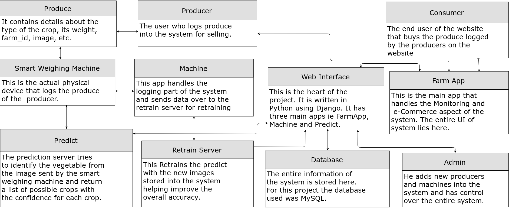
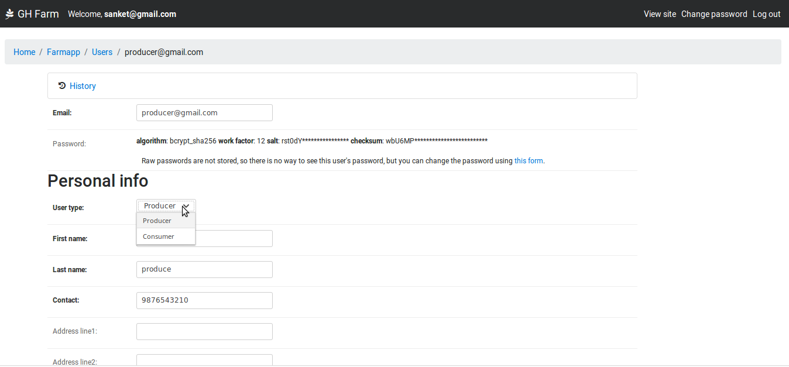
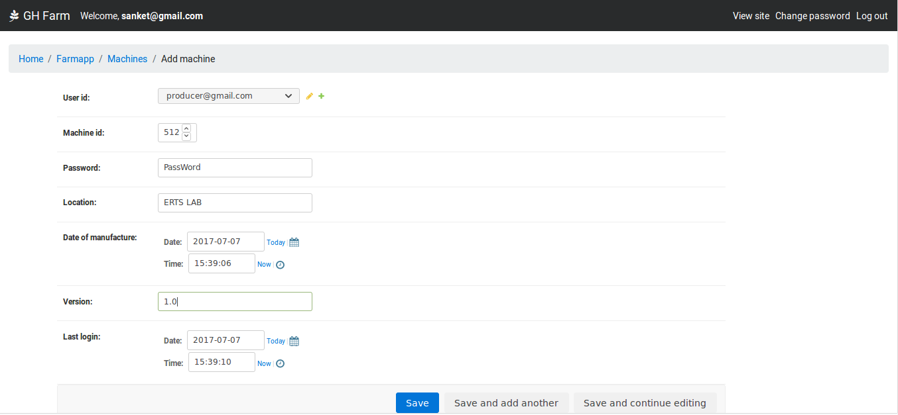
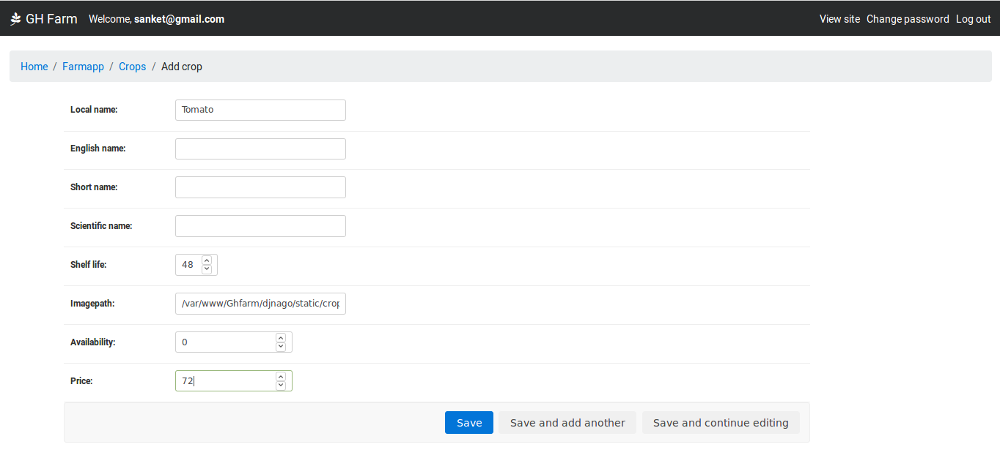

# Developer Manual

---

## 1) Overview:
This is the Manual for the project `Development of Web interface for GH Farm Produce`. This project was a part of the the e-Yantra Summer Internship Programme 2017 (e-YSIP 2017). The main aim of this project to make a automated system for the Logging and Monitoring of Farm produce from greenhouses. The system consists of a smart weighing machine powered by Raspberry Pi which logs all the data about the produce such as weight, crop type, trough id, time, etc. The details are then sent to server which maintains all the data and can provide analytics about the data. The smart weighing machine was developed last year as part of eYSIP'16 and the main goal of this years project is to improve the weighing machine, setup a web interface for the data and an e-commerce website to buy and sell the GH farm produce.

---

## 2) System Summary:
This section describes the basic working of the entire system in brief.

__2.1.__ ___Smart Weighing Machine:___

  The smart weighing machine consists of a Raspberry Pi, LCD display, keypad, load cell and a camera. To log the produce the producer places the produce from the GH farm on the weighing machine. The weighing machine with the help of the the load cell displays the weight on the LCD screen. So the machine can be used as a normal weighing machine. It also has standard weighing machine features like tare. Now the producer can log the produce by pressing `*` on the keypad. The Raspberry Pi then takes a picture of the produce and sends it to a prediction server to guess the type of the crop. The producer is then shown the possible crops as predicted by the `Vegetable Identification using Transfer Learning` project. If the crop predicted is correct the producer the continue or else he can change the crop by selecting one from a list of crops shown sorted according to the confidence of the predicting system or by inputting in the crop_id. Once he enters the crop_id the enter data is sent to the server for Logging. The data is logged and also made available for selling on the e-commerce website. The data is sent via HTTP requests making use of the modern REST API.

__2.2.__ ___Web Interface:___

  The web interface for this project was writtern in Python using Django. The UI is writtern in HTML with help of Bootstrap v4 to make the website responsive. The web interface has mainly three applications, they are:
  * __FarmApp:__

    This is the main App of the system. It provides with all the UI that the users i.e. Admin, Producer and Customers interact with.

  * __Machine:__

    This app is used only by smart weighing machine to log the produce. The data logged by the machine is sent via HTTP requests to this server for logging. Once the data reaches here it added into the system for buying as well as monitoring.

  * __Predict:__

    This is an utility app that runs the Vegetable Identification algorithm on the image sent to it and returns a list of possible crops along with the confidence percentages. This app is used by the smart weighing machine to guess the vegetable by the picture it takes with the webcam attached to it.

---

## 3) Users
There are three main users of this system. They are:

__3.1.__ __Admin:__
    Admin has control over the entire database and make modifications to the data as and when required. It is his responsibility to add new Producers or Crops into the database.

__3.2.__ __Producer:__
    Producers are the users who own the smart weighing machine and use them to add their produce to the system for monitoring and also to sell them. Each producer can have multiple machines allotted to him and all produce by this machines is logged into his account.

__3.3.__ __Consumer:__
    Consumers are the end users of the entire system. They can register onto the system and can buy the produce from the system and also rate the producers.

---

## 4) Getting Started

### 4.1 Setting up the smart weighing machine

  * ___Installation of Raspbian OS on Raspberry Pi___

    * [Download](https://www.raspberrypi.org/downloads)

    * [Installation]( https://www.raspberrypi.org/documentation/installation/installing-images)

  * ___Setting Up Raspberry Pi___
     * You can operate the Pi by connecting a Monitor, keyboard and mouse to the pi via the HDMI and USB ports.
(If a monitor is not available you can control the pi remotely via [SSH](https://www.raspberrypi.org/documentation/remote-access/ssh/) or [VNC](https://www.raspberrypi.org/documentation/remote-access/vnc/))

     * [Connect Raspberry Pi to the Internet](https://www.raspberrypi.org/documentation/configuration/wireless/wireless-cli.md)

     * _Setup_

     Copy raspberrypi folder to any directory and open up a terminal in that directory and enter
     ```
     sudo ./setup.sh
     ```
     This will do the following:
     * Copy the contents of this folder to `/home/pi/ghfarm/`.
     * Install all the necessary files for raspberry pi.
     * Setup crontask to run the `ghfarm.py` on reboot in a new tmux session with the name 'ghfarm'.
     * Setup crontask to run `client.py` every 5 minutes.

     **Notes:**
        * Before running the `setup.sh` make sure to change the `MACHINE_ID` and `PASSWORD` of the machine in the `constants.py` file.
        * You may be asked to enter password if the shell does not have root privileges

  * __Completion__

    * Connect the Raspberry Pi to the smart weighing machine and restore all the connections.
         (Please refer last year's [repo](https://github.com/Ankurrpanwar26/eYSIP-2016-Farm-Produce-Logging-and-Monitoring/blob/master/Final%20Report/EYSIP_final.pdf) to get more details about the weighing machine and connections)
    * Reboot the Raspberry Pi, the screen of the smart weighing machine should boot-up.


### 4.2  Starting the system on Development Server

#### Installations:
(For Debian based systems)

Clone the git [repository](https://github.com/eYSIP-2017/eYSIP-2017_Development_of_Web_Interface_for_GH_Farm_Produce/archive/master.zip), unzip it and open the folder. Now open a terminal in the `/django` directory and run the following commands.
```
$ sudo apt-get install python3 python3-pip python3-venv mysql-server
$ python3 -m venv /path/to/new/virtual/environment
$ source /path/to/new/virtual/environment/bin/activate
$ pip3 install -r requirements.txt
$ python3 manage.py migrate
```
#### Running the server:
After the above installation, To start the server you only need to open a terminal in the directory and enter

```
$ python3 manage.py runserver [host]:[port]
```
You will have to add `[host]` into ALLOWED_HOSTS list in `django/ghfarm/settings.py` file.

Type `[host]:[port]` into your web browser and the website should be running.


##### _Notes_:

* While installing mysql-server you will be asked to set password(for the "root" user), set it to "12345" or change the username and password in the `/django/ghfarm/settings.py` file.

* To run the server you need to install `mysqlclient` as `MySQLdb` does not support python3. It is already included in the requirements.txt

* For certain [reasons](https://docs.djangoproject.com/en/1.11/topics/migrations/#mysql) `python3 manage.py migrate` might not work as intended and might give a database does not exist error. In that case you need to source the database included in the `/database` directory.
Open up a terminal in the `/database` directory and enter
```
$ mysql -u [USER] -p
# Instead of [USER] type in your username. For our project we had it set to "root"
# Enter your password. For our project we had it set to "12345"
# your terminal prompt should change to `my INCOMPLETE
sql>` as shown below
mysql> create database ghfarm;
mysql> use ghfarm;
mysql> source database.sql;
mysql> exit;
$ cd ../django/
# change current directory to [project]/django/
$ python3 manage.py migrate --fake
```

### 4.3 Deploy Server on Apache.

#### 4.3.1. Setup the development server as shown in `4.2`.

#### 4.3.2. *Install Apache*
```
sudo apt-get install apache2 libapache2-mod-wsgi-py3
```

#### 4.3.3. *Testing Installation*

Open a terminal and type
```
sudo service apache2 start
```
Then open a browser and visit `localhost`. The Apache default home page should appear.

#### 4.3.4. *Configure Apache*
```
# Open the terminal in directory where you unziped this repo.
sudo chown www-data:www-data django/
sudo vi /etc/apache2/sites-enabled/000-default.conf
```
Then add the following lines to the file:
(Replace `/var/www/Ghfarm/` with path to directory where you unzipped this repo.)
```
  DocumentRoot /var/www/Ghfarm/django/
	WSGIDaemonProcess example.com python-path=/var/www/Ghfarm/django/
	WSGIApplicationGroup %{GLOBAL}
	WSGIProcessGroup example.com

	Alias /favicon.ico /var/www/Ghfarm/django/static/favicon.ico  

	Alias /media/ /var/www/Ghfarm/django/media/
	Alias /static/ /var/www/Ghfarm/django/static/
	Alias /images/ /var/www/Ghfarm/django/images/

	<Directory /var/www/Ghfarm/django/static>
	Require all granted
	</Directory>

	<Directory /var/www/Ghfarm/django/images>
	Require all granted
	</Directory>

	<Directory /var/www/Ghfarm/django/media>
	Require all granted
	</Directory>

	WSGIScriptAlias / /var/www/Ghfarm/django/ghfarm/wsgi.py process-group=example.com
	<Directory /var/www/Ghfarm/django/ghfarm/>
	<Files wsgi.py>
	Require all granted
	</Files>
	</Directory>
```

#### 4.3.5 _Restart Apache_

Type into the terminal
```
sudo service apache2 restart
```

---

## 5) Database Schema

### 5.1. Crop
Field| Type
----|----
crop_id|Primary Key (AutoIncr)
local_name|char
english_name|char
scientific_name|char
shelf_life|int in hrs
rice|float

### 5.2. User
Field| Type
----|----
id            | int(11) AutoIncr PrimaryKey         
password      | varchar(128)
last_login    | datetime(6)
email         | varchar(254)
first_name    | varchar(100)
last_name     | varchar(100)
address_line1 | varchar(100)
address_line2 | varchar(100)
state         | varchar(100)
country       | varchar(100)
pin_code      | varchar(20)
user_type     | varchar(20)
contact       | varchar(15)
is_active     | tinyint(1)
is_admin| tinyint(1)
last_cart_id | int(11)
login_count   | int(10) unsigned

### 5.3. Machine
Field| Type
----|----
machine_id | int PrimaryKey
password | varchar
location | varchar
date_of_manufacture | datetime
version | varchar
last_login | datetime
user_id | ForeignKey to User(Producer)

### 5.4. Produce
Field| Type
----|----
id  | int PrimaryKey AutoIncr
image | varchar (path to image)
weight | float (in g)
timestamp | datetime
date_of_produce | datetime
date_of_expiry | datetime
sold | float (in g)
wasted | float (in g)
crop_id | ForeignKey to Crop
machine_id | ForeignKey to Crop
show_image | Boolean
farm_id | Int

### 5.5. Inventory
Field| Type
----|----
id | int PrimaryKey
weight | float (in g)
sold | float (in g)
wasted | float (in g)
minimum | float (in g)
maximum | float (in g)
price | float (in rs/kg)
shelf_life | int (in hrs)
crop_id | ForeignKey to Crop
user_id | ForeignKey to User

### 5.6. Cart
Field| Type
----|----
Cart| int PrimaryKey

### 5.7. Cart Session
Field| Type
----|----
id| int PrimaryKey
cart_id| ForeignKey to Cart
crop_id| ForeignKey to Crop

### 5.8. Order
Field| Type
----|----
id | int PrimaryKey
weight | float (in g)
time | datetime
delivery_date | datetime
status    | varchar
cart_id | ForeignKey to Cart
crop_id | ForeignKey to Cart
seller_id | ForeignKey to User(Seller)
user_id| ForeignKey to User(Consumer)

### 5.9. Review
Field| Type
----|----
id | int PrimaryKey
rating | int
review | varchar
timestamp | datetime
cart_id | ForeignKey to Cart
customer_id | ForeignKey to User(Customer)
user_id | ForeignKey to User(Producer)

### 5.10. Alert
Field| Type
----|----
id  | int PrimaryKey
message | varchar
timestamp  | datetime
user_id | ForeignKey to User
type | varchar

---

## 6) Workflow
The basic worflow of the entire system can be summarized by the following chart:



---

## 7) Using the System

### 7.1 Adding Producer into the System




Only the Admin can add a new producer into the System. The admin should ask the Producer to signup as a normal customer. Once the Producer has created an account the Admin must login into the admin interface. Then in the user section find the producer via his email id and then change the user_type to 'Producer'.

### 7.2 Adding and Setting Up Machine for Producer



Only the admin can add a new machine for a Producer. Each producer can have multiple machines alloted to him.
* To add a machine, login into the admin panel. Here select add in the machine section. Now fill in the details for the machine and allot the user id to that of a Producer.
* Set the machine_id and password to some random value.
* Then set up the raspberry pi as shown in `4.1`. Do not forget to change the values of `MACHINE_ID`, `PASSWORD`, `URL` and `PREDICT_URL` to appropriate values in the `constants.py`.

### 7.3 Changing the UI of the system
The UI of the system is based on the templates located in the `django/templates/` directory. To change the UI of the system first of all the developer need to get an idea of the django templating and how django inheritance works. The basic template that is inherited by other templates is `base.html`. Changes made in it will be reflected throughout the website. For smaller changes find the view called for the current url from the `urls.py` file. Then find the template rendered by the view and modify it as required.

The current system is writtern with help `Bootstrap v4 (alpha)`. Since at the time of making the system Bootstrap was in alpha the system has some bugs which mostly would be fixed as bootstrap4 is released. The graphing was done with the help of the `django-graphos` which made use of `morris.js`.

### 7.4 Adding New Crop into the system



Only the admin can add new crop into the system. The admin can add new crop using the admin interface. The Admin has to enter the required details and default values for price and shelf_life for crop. The short_name must be of '14' characters so as to be visible on the machine. Also the crop can be added for prediction into the system as described [here](https://github.com/eYSIP-2017/eYSIP-2017_Vegetable-Identification-Using-Transfer-Learning/wiki/Adding-new-crops-to-the-system) by the [Identification project](https://github.com/eYSIP-2017/eYSIP-2017_Vegetable-Identification-Using-Transfer-Learning)

### 7.5 Create Admin

To create a admin type the following command in cmd.

```
python3 manage.py createsuperuser
```
You will be prompted to type in the details, after that the superuser should be created.

## 8) Notes

Some points to be noted:

* The Producer First Name and last name should be a single word without spaces as it is used in html as div id

* Do not change the owner of a machine after alloting it. If you have to do it try changing the user account or
else you will have to manually update all entries in inventory with the previous user to the new user.   

---
